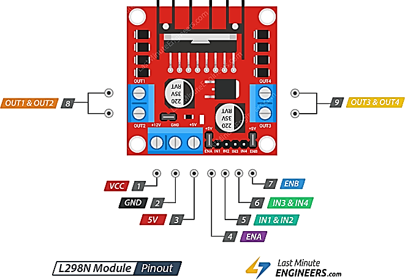

# SMART DOOR

FaceLock is an automated door locking and unlocking system powered by facial recognition. Designed for Raspberry Pi 5, it uses computer vision to identify authorized users and control a door lock accordingly. Ideal for home automation, secure offices, or smart lockers.

## FEATURES

- Real-time facial recognition
- Automatic door locking/unlocking
- Camera and DC motor integration with Raspberry Pi
- Local facial data storage and processing
- Easy setup and deployment

## HARDWARE REQUIREMENTS

- Raspberry Pi 5
- Pi Camera
- DC motor
- L298N motor driver
- Display

Proper [WIRING](#wiring) for the project is available below.

## USAGE

### 1. Project Setup

Use the following command to download the project and its requirements:

```bash
git clone https://github.com/Nikhil-Chanda/smart-door.git
cd smart-door
pip install -r requirements.txt
```

Make sure the Pi camera is connected properly and enabled in the settings (sudo raspi-config > Interface Options > Camera > Enable).

### 2. Collect Data

To capture images for training the facial recognition model, Run:

```bash
python3 image_capture.py
```

- A live camera feed will open.
- When your face is detected (indicated by a green box), press "SPACE" key to capture an image.
- Press "q" to exit after you're done.

**Note:** It is recommended to capture in total of atleast 9 different directions per person

```
↖ ↑ ↗
← O →
↙ ↓ ↘
```

### 3. Train Model

To train the model, run

```bash
python3 model_training.py
```

- This script processes the captured images and generates facial encodings.
- These encodings are saved and used during live recognition.
- The training process is lightweight and optimized to run smoothly on Raspberry Pi 5.

### 4. Running the System

To start the real-time facial recognition and motor control system, Run:

```bash
python3 main.py
```

- The camera continuously scans for faces.
- If a match is found in the trained dataset, the motor driver is activated to unlock the door.
- The system re-locks the door after a brief delay or based on further logic.

## WIRING

**Note** We refer to the BOARD layout in this project and not BCM layout. That means pin 1 will be 3v3 power, pin 2 will be 5v power and so on.


Raspberry Pi 5 GPIO



L298N Motor driver

- Connections are as follows:
  - RPi pin 2 -> L298n 5v
  - RPi pin 6 -> L298n GND
  - External 12v Power source -> L298n VCC
  - RPi pin 12 -> L298n IN1
  - RPi pin 16 -> L298n IN2
  - RPi pin 38 -> L298n ENA
  - DC Motor -> OUT1 & OUT2
- To close the motor:
  - RPi pin 4 -> RPi pin 37
